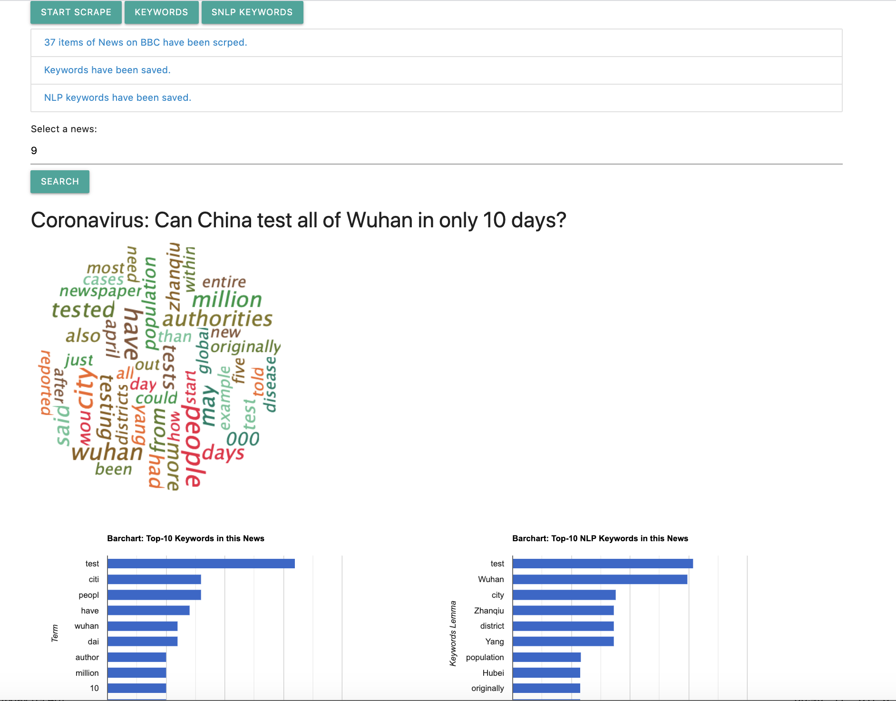

# Examenprojekt
Application can connect two major portal news website and scrap from base URL www.svt.se and www.bbc.com/news to the next first layer to get the data about title, content, publishing date and url of the latest news with own crawler.  And save data in local database. Compare two approaches of extracting keywords from content and display result in form of chart and word cloud.

# System Overview
* Development language: java JDK version 1.8.
* Development environment: Intellij IDEA.
* Java framework : Spring Boot
* Build and manage tool : Maven
* Database : MySQL
* Scraping framework: Apache HttpClient and Jsoup
* Text analysis framework: Apache Lucene Analyser, Stanford NLP
* Data Visualisation library: Google Chart and Kumo Word Cloud
* Test: JUnit Test and Mockito Test( for HttpClient)

# Running Page
* Implement **START SCRAPE -> KEYWORDS -> NLP KETWORDS**
* Input NewsID(<= the quantity+1 of news scrapde showed above)
* Get results

